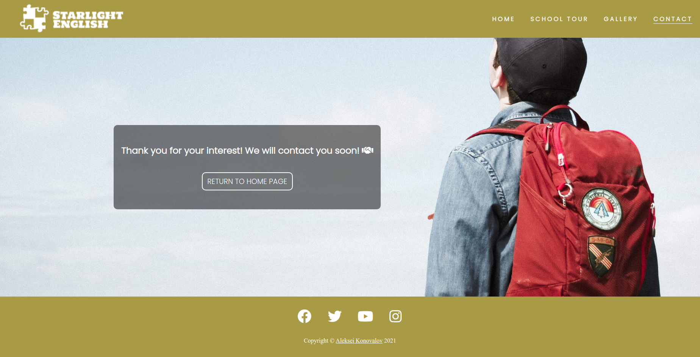

# *Starlight English*
---
[Starlight English](https://lexach91.github.io/esl-school-website) is a website for an ESL school and kindergarten. 

Here the parents can get required information about the school, become familiar with its staff and take a closer look at the facilities and environment.

---
## Features
+ ##### Navigation
    - Positioned at the top of the page.
    - Contains logo of the school at the left corner.
    - At the right side there are navigation links:
        * Home - leads to the home page.
        * School tour - leads to the virtual tour page.
        * Gallery - leads to the gallery page.
        * Contact - leads to the contact form page.
    - The link of the page that the user currently on is underlined.
    - The links have animated hover effect.
    - The navigation is clear and easy to understand for the user.
    - The navigation bar is responsive and appears in a form of a hamburger menu on mobile devices.

    
    
---
+ ##### Hero section
    - Hero section have an animated background image.
    - Hero section shows the text block with transparent background at the right side of the screen:
        * It has the name of the school.
        * It tells the user that the school is the best choice for their child.
        * It shows glowing button that can be clicked, and leads to the next section of the page.
    
    
---    
+ ##### About Us section
    - About us section contains an image at the left side.
    - About us section provides information about the school.
    - About us section tells the user why they should consider choosing the school for their child.
    
    
---
+ ##### Meet Our Team section
    - This sections contains three teacher cards.
    - The cards shown as an expanded deck of cards on desktop devices.
    - The cards are animated on hover.
    - Each card provides a photo of the teacher and their brief introduction.

    
---
+ ##### Become Familiar With Our Materials section
    - This section shows example flashcards used in the teaching process.
    - Each card contains a picture of a fruit.
    - On hover each card shows the name of the fruit and the audio.

    
---
+ ##### Footer
    - Footer contains social media links that open in a new tab.
    - Social media links are animated on hover.
    - Under the social media links there is a copyright sign with my github link.

    

---
+ #### School Tour page
    - Virtual tour page contains the same navigation bar at the top and the footer at the bottom.
    - Tour page also contains hero section, but with another background image and text.
    - Under the hero section there are four different sections:
        + Our main hall. 
        + Our classroom. 
        + Our canteen. 
        + Our art zone. 
    - Each of these sections tells the user about the facility and shows its picture.
    - Between every section there is a button that can be clicked to scroll to the next section.
    - The school tour page is responsive:
        + There are two columns (one is a picture, second is text) in the desktop mode.
        + There is one column for smaller screens and mobile devices.

    
---
+ #### Gallery page
    - Contains pictures of different activities held by the school.
    - Pictures scale a little on hover.
    - The gallery page is responsive:
        + There are four columns in the desktop mode.
        + There are two columns on smaller screens and on mobile devices in landscape mode.
        + There is only one column on mobile devices in portrait mode.

    
---
+ #### Contact page
    - This page has a contact form:
        + All text input fields are customized.
        + Labels are animated when the input field is in focus and are not empty.
        + The radio buttons are customized as well to look the same way in every browser.
        + The submit button is animated on hover.
    - The page is responsive and look good on all common screen sizes.
    - Submitting the form leads to the hidden response page that contains thank you message.

    
    

---
### Testing
+ I tested that the website works in different browsers: Chrome, Firefox, Brave.
+ I used devtools and [Responsive Website Design Tester](https://responsivedesignchecker.com/) to confirm that the website is responsive, looks and functions as it supposed to on all standard screen sizes.
+ I tested all the links and confirmed that all of them work and lead where they suppose to lead.

### Bugs
+ ##### Solved bugs
    - I used viewheight units at the contact page at first and found out that on mobile devices when you click into the text input field and the keyboard appears, it squished all the page and made it look ugly.
    - I fixed it by using the css property min-height, that prevents the page to be squished on all screens.
    ---
    - Another bug appeared in the landscape mode on mobile devices in the Meet Our Staff section. Teacher cards looked broken because it tried to show the section using media query breakpoint for small desktop screens.
    - I fixed it by adding another breakpoint specifically for landscape mode on mobile devices.
    ---
+ ##### Unsolved bugs
    - None.
---
### Validator testing
+ ##### HTML
    - No errors or warnings were found when passing through the official W3C validator.
+ ##### CSS
    - No errors or warnings were found when passing through the official W3C (Jigsaw) validator.
+ ##### Accessibility and performance 
    - Using lighthouse in devtools I confirmed that the website is performing well, accessible and colors and fonts chosen are readable.
    
    

---
### Deployment
+ The website was deployed to GitHub pages and can be accessed by the link: [Starlight English](https://lexach91.github.io/esl-school-website).
---
### Credits
+ ##### Content
    - The code to make social media links was taken from the Code Institute [Love Running](https://github.com/lexach91/love-running-project) project and modified to fit my website.
    - To make a responsive hamburger menu I watched some videos of [Kevin Powell](https://www.youtube.com/user/KepowOb) on his YouTube channel.
    - To make animated input fields I watched some videos of [Angela Delise](https://www.youtube.com/channel/UC_TjoSnaI3CTgIgmSn3rruA) on her YouTube channel.
+ ##### Media
    - All the images for the website were taken from [Unsplash](https://unsplash.com/)
    - All audio files were recorded by me on my phone.

---
#### Wireframes

